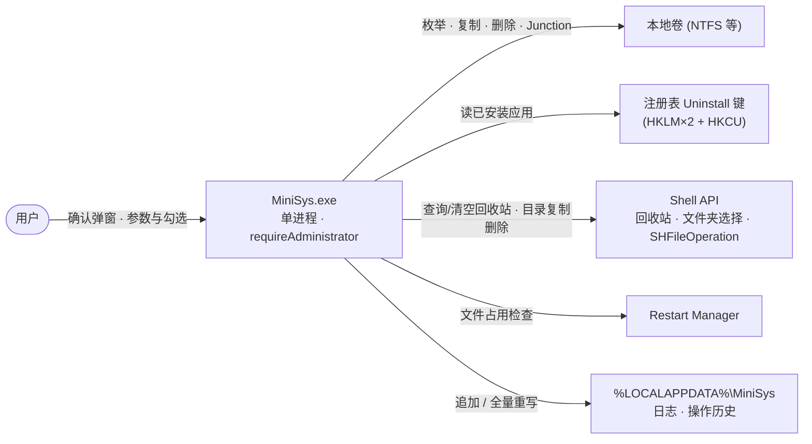
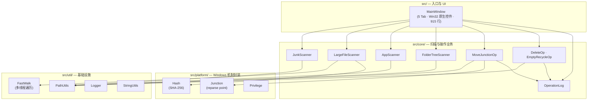
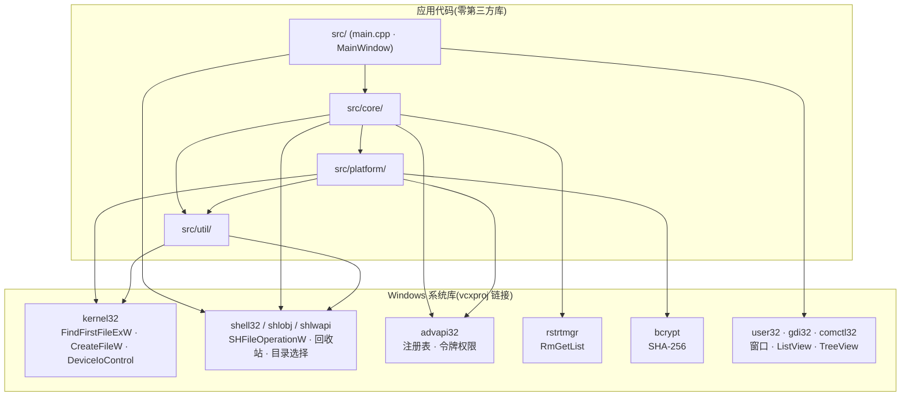
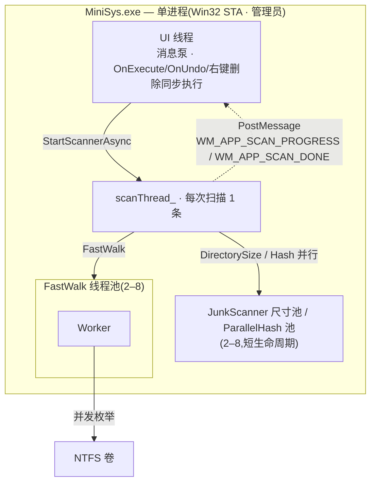
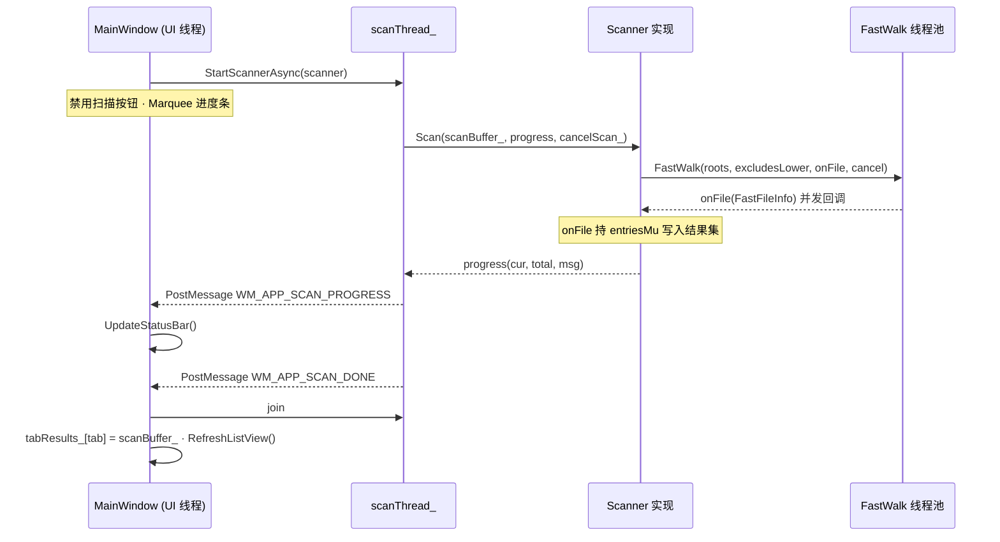
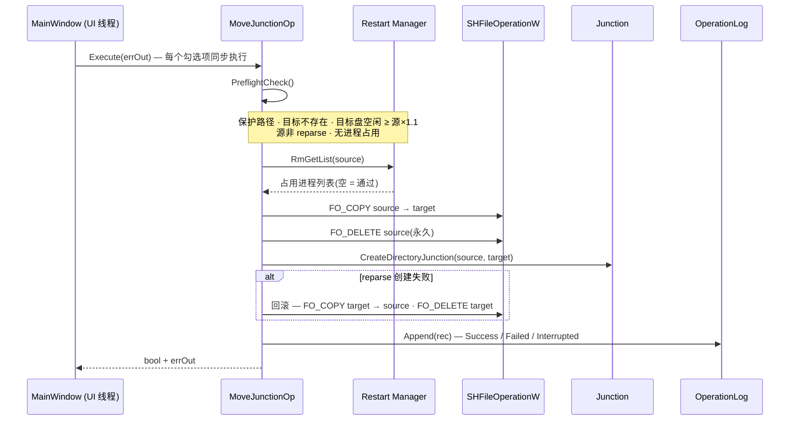
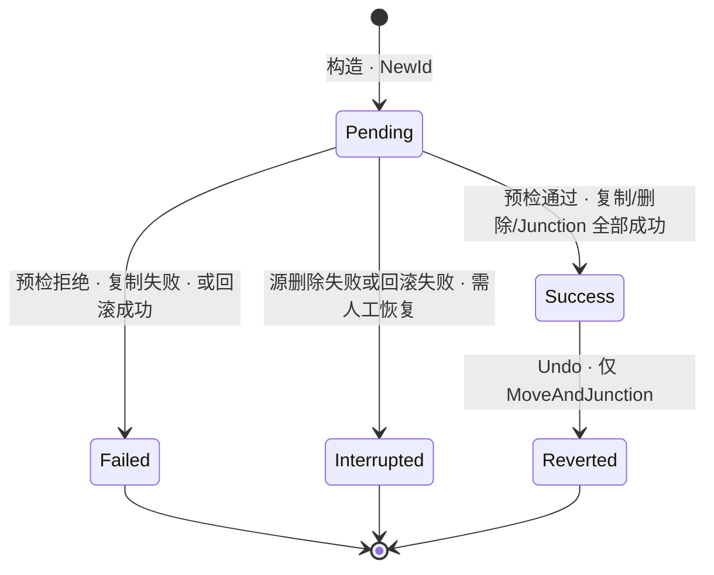

# MiniSys v1 架构文档

> 基线:仓库 efd9e63(2026-09)· 全量代码审阅:16 个 .cpp / 19 个 .h,约 3,000 行
> v2 演进方案见 [DESIGN-v2.md](DESIGN-v2.md);本文只描述**已实现**的 v1 架构。
>
> **更新(2026-09-29)**:DESIGN-v2 的 M0–M4 已按路线图实施完毕(SessionService/Presenter、GuardRails+QuarantineOp+PlanBuilder、VolumeIndex USN 索引与增量、DelegateOp、崩溃 minidump),现状架构见 [DESIGN-v2-实施报告.md](DESIGN-v2-实施报告.md)。本文保留为 v1 基线的评审依据;第 13 节风险表在 v2 中的处置:R-001/R-002/R-004/R-006/R-008 已修复,R-003/R-005/R-007/R-011 部分缓解,R-009/R-010 维持。

## 1. Overview

MiniSys 是面向 Windows 的单进程 Win32 桌面工具("C 盘瘦身助手"),提供 5 个功能页:垃圾清理、大文件/去重、应用迁移(复制到目标盘 + 原位 Junction)、文件夹分析、操作历史。C++17 / x64,零第三方依赖,以管理员身份运行。

## 2. Architecture Context



纯本地工具,无网络与第三方服务交互。所有破坏性操作(删除/迁移/清空回收站)均经用户弹窗确认后执行。

## 3. Logical Architecture



`Scanner` / `Operation` 是两个纯虚接口,分别由 4 个扫描器与 3 个操作实现,契约见第 8 节。图中省略次要依赖:platform/util 层内部互调(均向下依赖 PathUtils / StringUtils),以及全模块对 Logger 的写日志依赖。

## 4. Component Responsibilities

| Component | 负责 | 不负责 |
|---|---|---|
| `MainWindow` | Tab/控件布局与显隐、扫描配置读取、扫描线程派发与结果收集、勾选确认、按 Tab 构造 Operation 执行、历史渲染与撤销入口 | 扫描算法、文件操作细节、历史持久化格式 |
| `JunkScanner` | 12 条静态规则(用户/系统 Temp、WU 下载缓存、CBS/DISM 日志、Minidump、Edge/Chrome 各 3 项)+ Firefox 多 Profile 动态发现 + 回收站 + 3 个 info-only 系统文件,并行尺寸计算 | 删除执行、规则外垃圾发现 |
| `LargeFileScanner` | 阈值/扩展名/磁盘过滤、top-N(partial_sort,默认 200)、三级去重 | 目录树分析、规则类垃圾 |
| `AppScanner` | 3 个 Uninstall hive 枚举、按 InstallLocation 去重、仅保留系统盘 ≥50MB 应用 | 迁移执行、UWP/Store 应用(isUWP 字段从未赋值) |
| `FolderTreeScanner` | 固定盘顶层目录枚举与递归尺寸(串行) | 结果展示(TreeView 属 MainWindow)、删除 |
| `DeleteOp` | 回收站删除(SHFileOperationW + FOF_ALLOWUNDO)、写历史 | 自动恢复(v1 未实现,提示手动) |
| `EmptyRecycleOp` | 清空全系统回收站(不可逆)、写历史 | — |
| `MoveJunctionOp` | 四步预检、复制 + 永久删源 + 建 reparse、失败回滚、撤销 | 目标盘选择(UI 层)、"应用可安全迁移"的语义判断 |
| `OperationLog` | history.tsv 追加/全量重写/加载、ID 生成、枚举序列化(单例) | 撤销逻辑本身 |
| `FastWalk` | 2–8 线程目录遍历、reparse 剪枝、前缀排除、取消传播 | 结果聚合与过滤(onFile 由调用方处理) |
| `PathUtils` | 磁盘空间/驱动器枚举/系统盘判断、回收站查询清空、DirectorySize、长路径前缀 | 遍历调度与并发(FastWalk 的职责) |
| `Junction` | reparse point 创建/删除/读取(手写 REPARSE_DATA_BUFFER) | 目录数据的复制/删除 |
| `Hash` | BCrypt 流式 SHA-256(全量/头部) | 去重分组策略 |
| `Privilege` | 提权判断、令牌权限启用 | UAC 声明(app.manifest) |
| `Logger` | 文件 + OutputDebugString 双写、逐条 flush、线程安全 | 日志轮转 |

## 5. Dependency Architecture



依赖方向严格向下(ui → core → platform/util,platform → util),无环。链接库清单(MiniSys.vcxproj):comctl32, shell32, shlwapi, advapi32, ole32, uuid, bcrypt, rstrtmgr, user32, gdi32。

## 6. Runtime / Deployment Architecture



扫描线程不触碰任何控件,只 PostMessage;结果经 `scanBuffer_` 缓冲,`WM_APP_SCAN_DONE` 处理器 join 线程后搬入 `tabResults_`。执行(复制/删除/建 Junction)全部发生在 UI 线程,期间界面无响应(R-001)。

## 7. Key Sequences

### 7.1 扫描链路(以 LargeFileScanner 为例)



JunkScanner 不走 FastWalk,直接并行调用 `DirectorySize`;AppScanner 只读注册表。取消仅由程序退出触发,UI 无取消按钮(R-003)。

### 7.2 应用迁移执行(MoveJunctionOp::Execute)



撤销链路(History 页):`Undo` 反向执行 — 删 Junction → 拷回 → 删 target → `UpdateStatus(Reverted)`;仅 `MoveAndJunction` 类型可自动撤销。

## 8. Interface / Contract

| Interface | 定义位置 | 语义 | 关键约定 | Sync/Async |
|---|---|---|---|---|
| `Scanner::Scan(out, progress, cancel)` | core/Scanner.h | UI → 扫描器 | 同步填充 out;progress 可为空;cancel 在目录边界生效 | 调用方提供工作线程 |
| `FastWalk(roots, excludesLower, onFile, cancel, numThreads, onProgress)` | util/FastWalk.h | Scanner → 遍历层 | onFile 并发回调,调用方自行加锁;numThreads ≤ 0 自动(2–8);永不穿越 reparse;排除为小写前缀匹配 | 阻塞至完成 |
| `Operation::Execute / Undo(errOut)` | core/Operation.h | UI → 操作 | bool + 错误文本;实例自持 OpRecord 并写日志 | 同步 |
| `MoveJunctionOp::PreflightCheck()` | core/MoveJunctionOp.h | 执行前 | 无副作用;返回空串 = 通过,否则为拒绝原因 | 同步 |
| `OperationLog::Append / UpdateStatus / LoadAll` | core/OperationLog.h | 全模块 → 持久化 | 单例 + mutex;UpdateStatus 全文件重写 | 同步 |
| `CreateDirectoryJunction / CreateDirectorySymlink / RemoveDirectoryReparsePoint / ReadReparseTarget` | platform/Junction.h | 操作层 → NTFS | linkPath 不得已存在;错误文本含 Win32 错误号 | 同步 |
| `Sha256OfFile / Sha256OfFileHead` | platform/Hash.h | Scanner → 哈希 | BCrypt 流式;失败返回空串 | 同步 |
| `WM_APP_SCAN_PROGRESS / WM_APP_SCAN_DONE` | res/resource.h | 扫描线程 → UI 线程 | 消息不带参数,进度文本经 `progressMu_` 保护的成员传递;DONE 处理器负责 join | 异步 PostMessage |

## 9. State / Lifecycle(OpRecord 状态机)



`Pending` 只存在于内存,落盘记录均为终态。`EmptyRecycleOp` 恒 `isReversible=false`;`DeleteOp` 成功后 Undo 在 v1 返回"请手动从回收站恢复"(R-002),实际能到达 `Reverted` 的只有 `MoveAndJunction`。

## 10. Data Model

### ScanItem(扫描结果统一载体,core/Scanner.h)

| 字段 | 语义 |
|---|---|
| `category` / `title` / `path` | 分组类别(如 "Browser Cache"、盘符)/ 显示名 / 主路径 |
| `sizeBytes` / `createTime` | 字节数 / FILETIME(100ns,1601 纪元) |
| `detail` | 附加信息(路径、SHA-256 前缀、项数) |
| `recommended` / `dangerous` | UI 预勾选 / 额外危险确认 |
| `groupKey` | 去重分组键(`DUP-<hash前12>`) |

### OpRecord(操作记录,core/Operation.h)

| 字段 | 语义 |
|---|---|
| `type` | DELETE / EMPTY_RECYCLE / MOVE_JUNCTION / MOVE_FILE(MOVE_FILE 无实现) |
| `status` | PENDING / SUCCESS / FAILED / REVERTED / INTERRUPTED |
| `id` / `timestamp` | `yyyymmdd-hhmmss-计数器` / 本地时间串 |
| `source` / `target` | 主路径 / 迁移目标(删除类为空) |
| `sizeBytes` / `note` | 大小 / 错误与上下文 |
| `isReversible` | EmptyRecycle=false,其余 true |

### 持久化(%LOCALAPPDATA%\MiniSys\)

```
MiniSys\
├─ logs\minisys.log        # 追加写 · 逐条 flush · 无轮转
└─ history\history.tsv     # 9 列 · tab 分隔 · %XX 转义(%→%25, tab→%09, CR→%0D, LF→%0A)
```

history.tsv 列序:id, timestamp, type, status, sizeBytes, isReversible(0/1), source, target, note。加载时按行序反转为最新在前。

## 11. Non-Functional Requirements

| Category | Requirement / 现状 |
|---|---|
| 遍历性能 | FastWalk 2–8 线程,FindFirstFileExW(FindExInfoBasic + FIND_FIRST_EX_LARGE_FETCH);JunkScanner 规则级并行 DirectorySize;LargeFileScanner partial_sort 取 topN |
| 去重 IO | 三级过滤:同 size → 头 64KB SHA-256 → 全量 SHA-256(2–8 线程并行) |
| 可靠性 | 删除默认入回收站(FOF_ALLOWUNDO);迁移失败自动回滚;Interrupted 记录人工恢复指引 |
| 安全 | 保护路径黑名单(Windows、WindowsApps、ProgramData\Microsoft、$Recycle.Bin、SVI);遍历永不穿越 reparse;迁移目标强制非系统盘;dangerous 项二次确认;RmGetList 占用预检 |
| 权限 | requireAdministrator;启动启用 SE_BACKUP / SE_RESTORE / SE_CREATE_SYMBOLIC_LINK(失败不阻断) |
| 兼容性 | Windows 10/11 x64(manifest supportedOS);C++17(/stdcpp17 · ConformanceMode);长路径(longPathAware + `\\?\` 前缀);PerMonitorV2 DPI |
| 资源 | 历史文件全量重写;日志无轮转;单 exe、无运行时依赖 |

## 12. Key Decisions(ADR)

| ID | Decision | Status | Alternatives | Reason | Impact |
|---|---|---|---|---|---|
| ADR-001 | 应用迁移 = 复制 + 永久删源 + 原位 Junction | Accepted | 跨卷原子 Move | NTFS 跨卷无原子 move;Junction 对应用透明 | 目标盘需 ≥ 源×1.1 空间;存在中间态(靠回滚 + Interrupted 兜底) |
| ADR-002 | 默认 Junction,高级模式可选 Symlink | Accepted | 仅 Symlink | Junction 无需特权;Symlink 需管理员/开发者模式 | UI 增加高级复选框 |
| ADR-003 | 删除默认走回收站(SHFileOperationW + FOF_ALLOWUNDO);清空回收站为唯一不可逆操作 | Accepted | 永久删除 | 需求要求可恢复 | 自动撤销 v1 未实现(R-002) |
| ADR-004 | 扫描独立线程 + PostMessage 回 UI | Accepted | UI 线程直接扫 | 避免冻结界面 | DONE 消息处理器需处理 join 时序 |
| ADR-005 | 遍历(FastWalk / DirectorySize)永不穿越 reparse point | Accepted | 跟随链接 | 防环、防跨卷、防重复计数 | 迁移后的目录不会被二次计数 |
| ADR-006 | 零第三方依赖,纯 Win32 + C++17 STL | Accepted | Qt / WinUI 等 | 单 exe、构建链极简(build.bat + MSBuild) | UI 全手写(915 行);持久化自研 TSV |
| ADR-007 | 操作历史 TSV + %XX 转义,单例 OperationLog | Accepted | SQLite / JSON | 轻量、可 diff、无解析依赖 | UpdateStatus 全文件重写且非原子(R-004) |
| ADR-008 | Junction 经 DeviceIoControl 手写 REPARSE_DATA_BUFFER | Accepted | mklink 子进程 | ntifs.h 属 WDK;子进程不可控 | 需自处理 `\??\` 前缀与字节布局 |
| ADR-009 | 去重三级过滤 size → head 64KB → 全量 SHA-256 | Accepted | 直接全量哈希 | 大幅减少 IO | 无误报(全量哈希兜底) |
| ADR-010 | requireAdministrator 清单 | Accepted | asInvoker + 按需提权 | 简化权限模型(始终 elevated) | 每次启动 UAC;不符最小权限原则 |

## 13. Risks / Open Issues

| ID | Issue / Risk | Impact | Status |
|---|---|---|---|
| R-001 | OnExecute / OnUndo / 右键删除在 UI 线程同步执行,批量迁移大应用期间界面无响应 | High | Open |
| R-002 | 删除类自动撤销未实现(v1 代码注释明示),依赖用户手动开回收站恢复 | Medium | Open |
| R-003 | 扫描无取消入口:cancelScan_ 仅在程序退出时置位 | Medium | Open |
| R-004 | OperationLog::UpdateStatus 全文件重写、非原子(无 temp+rename),崩溃可损坏历史 | Medium | Open |
| R-005 | MoveJunctionOp 中断态(Interrupted)后无恢复 UI,仅 note 文本提示人工处置 | High | Open |
| R-006 | 默认扫描根重复:DefaultRoots = {%UserProfile%, C:\} 且 Users 不在排除表 → 用户目录下每个大文件被枚举两次,top-N 出现重复行;去重阶段把同一文件判为"重复对",[DELETE] 行实际指向唯一副本 | High | Open |
| R-007 | LargeFileScanner::onFile 持全局 entriesMu,遍历并行度受限 | Medium | Open |
| R-008 | build.bat 第 9 行 `if "%PLATFORM%"=""` 缺 `=`,cmd 语法错误导致脚本直接中止(实测复现)——脚本当前完全无法完成构建 | Medium | Open |
| R-009 | 死代码/预留:WM_APP_OP_DONE、IDC_BTN_REFRESH、IDC_BTN_DEDUP、IDI_APPICON、OpType::MoveFilePath、AppInfo::isUWP | Low | Open |
| R-010 | 日志无轮转,长期追加增长 | Low | Open |
| R-011 | main.cpp SetProcessDPIAware 与 manifest PerMonitorV2 声明冗余 | Low | Open |

## 14. 待确认项

- [ ] R-006 根重复问题的实际表现(代码逻辑推演,未实际运行验证;用户在磁盘过滤框输入 C;D 后不会触发)
- [ ] AppScanner 是否会列出 Store/UWP 应用(枚举源仅传统 Uninstall 键,推测不会,未实测)
- [ ] 需求 3"按不同的操作类型分别批量执行"是否即"按 Tab 分别批量执行"(推断,无需求映射文档)
- [ ] 支持的最低 Windows 版本未实测(manifest 声明 Win10+)
