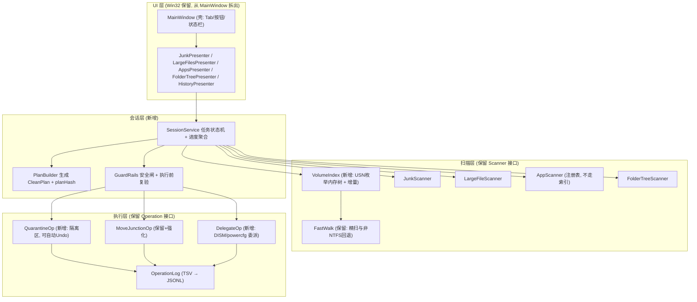
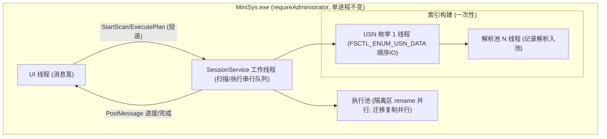
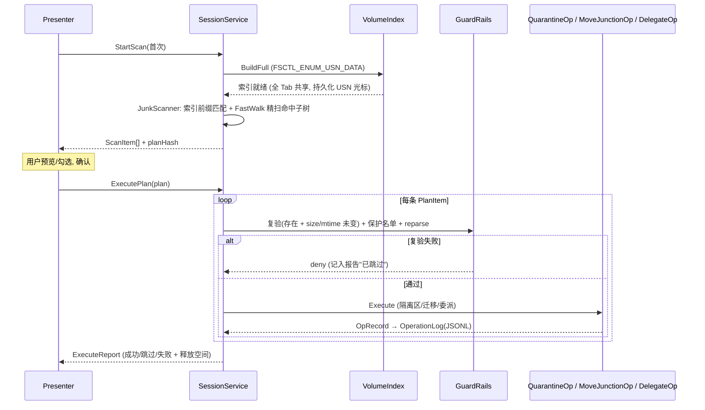
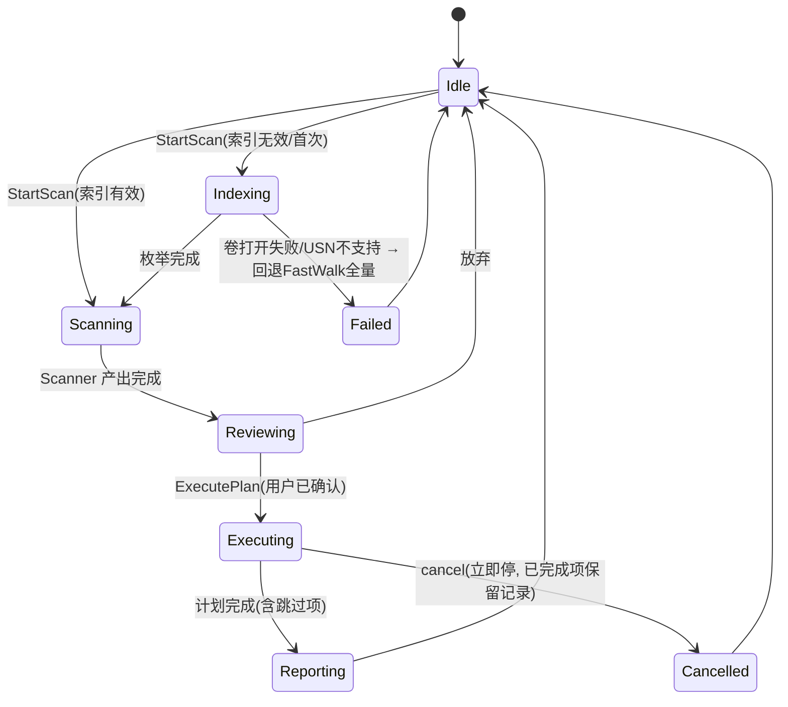
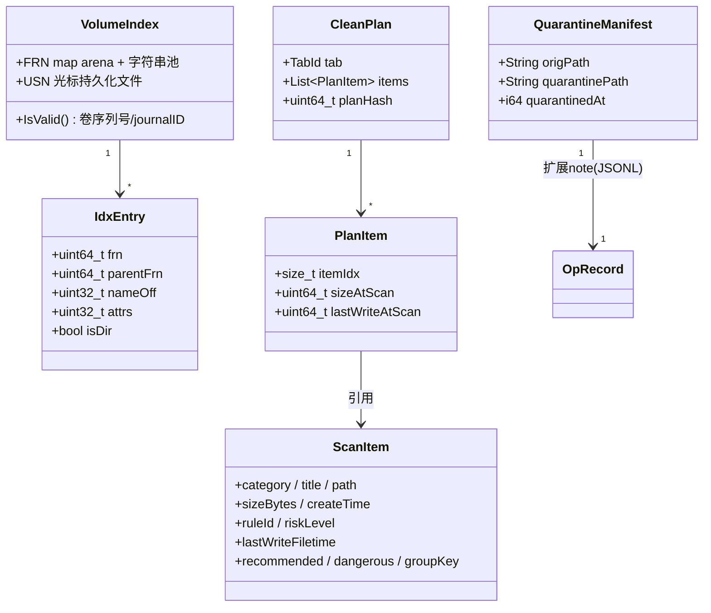

# MiniSys v2.0 技术方案 — 基于 v1 骨架的演进设计

> 状态：设计稿｜日期：2026-09-29｜基线：MiniSys 仓库 efd9e63（约 2600 行，C++ / Win32 / x64）
> 本文档取代此前的《DiskSlim 设计 v1.0》（Rust+Tauri 双进程方案）。经代码评估，v1 骨架的抽象正确、可运行，v2.0 选择**演进而非重写**。

---

## 1. Overview

MiniSys v2.0 的目标不变（需求.txt 四条：APP 无损迁移、C 盘垃圾清理、确认+批量+可恢复、大文件重点扫描），在现有 `Scanner`/`Operation` 双抽象上演进出三块能力：

- **共享索引**：一次磁盘枚举服务全部 5 个 Tab（现状：Junk/LargeFiles/FolderTree 各自独立扫盘，同一块盘被遍历多遍）。
- **执行安全链**：扫描 → CleanPlan → 逐条复验 → GuardRails → 执行（现状：UI 勾选后直接执行，扫描与执行之间文件可变、无保护名单兜底）。
- **完整可逆**：删除类操作自动可撤销（现状：仅迁移类可自动 Undo，`DeleteOp::Undo` 为空实现）。

性能路线：`FastWalk`（现状，FindFirstFileExW 多线程）→ `VolumeIndex`（USN 枚举建内存树）→ USN 增量刷新 →（可选）`$MFT` 直读补全量 size。

---

## 2. 现状基线（代码确认的事实）

### 2.1 需求完成度

| 需求.txt | 现有组件 | 状态 |
|---|---|---|
| 1. APP 无损迁移 | `AppScanner`（Uninstall 注册表 + UWP 识别）、`MoveJunctionOp`（预检：1.1x 空间 / RmGetList 占用 / 保护路径） | 骨架可跑。缺：UWP/Store 应用排除迁移、迁移后 junction 自检 |
| 2. C 盘垃圾/临时扫描 | `JunkScanner`：硬编码 ~15 条规则（Temp×2、WU Download、CBS/DISM 日志、Minidump、Edge/Chrome **仅 Default Profile**、Firefox cache2、回收站、hiberfil/pagefile info-only） | 规则窄、无风险分级、无 age 过滤、无微信/QQ/开发缓存 |
| 3. 确认/批量/恢复 | `MainWindow::OnExecute`（弹窗确认→串行逐个执行）、`OperationLog`（TSV 持久化，Undo 仅 `MoveAndJunction`） | 确认✓。删除类**无自动撤销**（代码注释明示 v1 未实现）；执行串行；无复验 |
| 4. 大文件重点扫描 | `LargeFileScanner`（minBytes/topN/extFilter/重复检测）+ `FolderTreeScanner` | 基本可用 |

### 2.2 结构性问题（v2.0 要解决的）

| ID | 问题 | 证据 | 影响 |
|---|---|---|---|
| P-1 | 重复遍历：每个 Tab 独立扫盘 | `JunkScanner` 用 `DirectorySize` 逐规则扫、`LargeFileScanner`/`FolderTreeScanner` 各自 `FastWalk` 全量 | 同一块盘扫 3 遍，用户体感"每切一个 Tab 就重新等" |
| P-2 | 无执行复验与统一安全闸 | `OnExecute` 直接由 UI 勾选构造 `Operation` 执行 | 扫描后文件被替换/移动的 TOCTOU 风险；安全完全依赖扫描器只扫"对的地方"，无兜底 |
| P-3 | 删除不可自动恢复 | `DeleteOp::Undo` 返回提示让用户手动开回收站 | 违反需求 3"执行有问题之后要有恢复的能力" |
| P-4 | UI 与业务耦合 | `MainWindow.cpp` 915 行，扫描线程、结果存储 `tabResults_`、执行逻辑全在一个类 | 加功能（隔离区/委派操作/增量）会继续膨胀 |
| P-5 | 回收站删除的性能/可靠性 | `DeleteOp` 用已废弃的 `SHFileOperation`，超大目录/超长路径子项会整体失败 | 批量清理时的主要失败源 |

已正确、保留不动的部分：`FastWalk` 的 reparse point 永不跟随 + 长路径 + 前缀排除；`MoveJunctionOp` 的四步预检；requireAdministrator 单进程模型（简化权限，自用工具合理）；`OperationLog` 的落盘即写。

---

## 3. Logical Architecture（目标）

三个不变量：**所有 Scanner 消费同一份 `VolumeIndex`**（解决 P-1）；**所有 Operation 的构造必须经 `PlanBuilder`+`GuardRails`**，UI 不再直接 new Operation（解决 P-2）；**默认执行策略为 QuarantineOp**（解决 P-3）。

---

## 4. Component Responsibilities

| Component | 负责 | 不负责 | 相对 v1 |
|---|---|---|---|
| MainWindow | 窗口壳、Tab/控件布局、消息路由 | 扫描线程、结果持有、执行逻辑 | 瘦身（915 行 → 目标 <400 行） |
| *Presenter ×5 | 各 Tab 的列表/树渲染、勾选状态、上下文菜单 | 发起扫描/执行（委托 SessionService） | 新增 |
| SessionService | 扫描任务生命周期、后台线程、进度 PostMessage 回 UI、CleanPlan 生命周期 | 文件匹配、删除 | 新增（自 MainWindow 抽出） |
| VolumeIndex | USN 枚举建树（FRN/parentFRn/name/attrs）、懒拼路径、子树查询、USN 增量、索引失效检测 | 文件大小（USN 记录不含 size，见 ADR-004）、删除 | 新增 |
| FastWalk | 垃圾规则命中子树的精扫（取 size/mtime）、非 NTFS 回退 | — | 保留，角色收窄 |
| JunkScanner | 消费索引做规则前缀匹配 + FastWalk 精扫汇总 | 执行删除 | 重构 |
| PlanBuilder | 勾选项 → CleanPlan，计算 planHash | 复验 | 新增 |
| GuardRails | 保护路径黑名单、reparse/云占位拦截、执行前逐条复验（存在性+size+mtime）、策略约束（WinSxS 只许 DelegateOp 等） | 规则定义 | 新增 |
| QuarantineOp | 移入隔离区（同卷 rename）、manifest 记录映射、自动 Undo、过期清空 | 真删除（清空是独立操作） | 新增（替代 DeleteOp 默认位） |
| DeleteOp | 回收站删除（保留为可选策略，迁移到 IFileOperation） | 自动 Undo | 降级为可选 |
| MoveJunctionOp | 迁移 + junction + 迁移后自检 | — | 保留+强化 |
| DelegateOp | 委派 DISM/powercfg/cleanmgr，解析输出报进度 | 手删系统文件 | 新增 |
| OperationLog | JSONL 持久化、undo 元数据（隔离区映射）、TSV 历史一次性迁移 | — | 格式升级 |

---

## 5. Runtime & Threading

- 扫描与执行共用一个 SessionService 串行队列（同一时刻只有一个任务），线程由 SessionService 持有，MainWindow 只收 PostMessage——现有 `scanThread_`/`progressMu_` 逻辑整体迁移。
- 索引构建 I/O 礼让：枚举线程设 `PROCESS_MODE_BACKGROUND_BEGIN`（v1 的 FastWork 未做，扫描时前台会卡）。
- 隔离区同卷 rename 天然并行安全（不同目录无锁冲突）；跨盘迁移复制按目录粒度并行（复用 FastWalk 的池）。

---

## 6. Key Sequence（v2 执行链路）

二次扫描路径：`StartScan` 先查 `VolumeIndex::IsValid()`（卷序列号 + USN Journal ID 未变），有效则 `RefreshFromUsn()` 增量，无效则重建。

---

## 7. State / Lifecycle（SessionService 任务状态）

---

## 8. Interface / Contract（新增/变更的核心接口）

| Interface | 位置 | 签名要点 | Sync/Async | Error 语义 |
|---|---|---|---|---|
| `VolumeIndex::BuildFull` | core/VolumeIndex.h（新增） | `bool BuildFull(wchar_t drive, ProgressFn, const atomic<bool>& cancel)` | 工作线程 | USN 不支持/打开失败 → false，调用方回退 FastWalk |
| `VolumeIndex::RefreshFromUsn` | 同上 | 增量应用变更记录 | 工作线程 | Journal ID 变 → 整体重建 |
| `VolumeIndex::CollectSubtree` | 同上 | 按 FRN 懒拼路径回调（不落地全量 wstring） | — | — |
| `SessionService::StartScan` | core/SessionService.h（新增） | `(TabId, ScanOptions)` | Async + PostMessage 进度 | `ERR_BUSY` |
| `SessionService::ExecutePlan` | 同上 | `(const CleanPlan&, ExecuteOptions)` | Async + 进度 | `ERR_PLAN_STALE`（planHash 失配 → 提示重扫） |
| `PlanBuilder::Build` | core/PlanBuilder.h（新增） | `(TabId, vector<ScanItem>, 勾选集) → CleanPlan` | Sync | — |
| `GuardRails::Validate` | core/GuardRails.h（新增） | `(const PlanItem&, const ScanItem&) → Verdict{allow, reason}` | Sync | deny 不算错误，入"已跳过"清单 |
| `QuarantineOp::Execute/Undo` | core/QuarantineOp.h（新增） | 继承 Operation；manifest 记 source→quarantine 映射 | — | Undo 冲突时还原为 `*.restored` |
| `DelegateOp::Execute` | core/DelegateOp.h（新增） | `(命令行, 参数, 输出解析回调)` | — | 退出码非 0 → Failed + 输出摘要 |

`ScanItem` 扩展字段（`core/Scanner.h`）：`ruleId`（关联规则表）、`lastWriteFiletime`（复验比对）、`riskLevel`（替代裸 `dangerous` 布尔，三值）。删除类错误码沿用"跳过不算失败"语义（`ERR_FILE_IN_USE` 入报告）。

---

## 9. Data Model

内存预算：IdxEntry 100 万条 ≈ 24B/条固定 + 字符串池 ≈ 全量 < 150MB；懒拼路径避免全量 wstring（100 万条全拼会超 300MB）。`planHash` = xxHash64(路径 + size + mtime)。

---

## 10. 清理规则清单 v2（分级 + 外置 JSON）

规则从 `JunkScanner.cpp` 硬编码迁到 `rules.json`（随 exe 分发，可热更新），扩展 `Rule` 结构增加 `riskLevel / minAgeDays / strategy`：

| 级别 | 类别（现状→v2） | 策略 | 默认 |
|---|---|---|---|
| Safe | 用户/系统 Temp、缩略图缓存、D3DSCache、WER、字体缓存、浏览器缓存（**补全所有 Profile**：`User Data\*\Cache` 而非仅 Default）、Delivery Optimization | 隔离区 | 勾选 |
| Safe | 微信/QQ 接收文件缓存（用户树选子目录）、开发缓存（npm/pip/cargo/Maven/Gradle/NuGet） | 隔离区 | 勾选（age>30d） |
| Cautious | WU Download、CBS/DISM 日志、Minidump（现状已有，归入此级） | 隔离区 | 不勾选 |
| Cautious | Windows.old、`hiberfil.sys`（现状 info-only → 接 `DelegateOp powercfg /h off`） | 委派 | 不勾选 |
| Advanced | WinSxS（现状无 → `DelegateOp DISM /StartComponentCleanup`，**永不手删文件**） | 委派 | 不勾选 |
| Info-only | `pagefile.sys`/`swapfile.sys`（维持现状：展示+引导文案，不可执行） | — | — |

`recommended`/`dangerous` 两个布尔由 `riskLevel` 推导，`OnExecute` 的危险二次确认逻辑不变。

---

## 11. Non-Functional Requirements

| Category | Requirement |
|---|---|
| 首扫（冷） | Junk Tab ≤ 30s（C 盘 100 万文件，NVMe，含索引构建 + 精扫）—— **设计目标，待基准** |
| 二扫（索引有效） | ≤ 5s；USN 增量路径 ≤ 2s —— **设计目标，待基准** |
| 执行吞吐 | 隔离区同卷 rename ≥ 2000 项/s；批量执行不阻塞 UI | 
| 内存 | 索引常驻 ≤ 150MB（100 万文件）；进程总峰值 ≤ 400MB |
| 安全 | GuardRails 拦截率 100%（注入测试：System32 路径进 plan 必须被拒）；planHash 失配整单中止 |
| 可逆 | 隔离区条目 100% 可自动 Undo；7 天过期或用户手动清空 |
| 兼容 | Win10 1809+；NTFS 走索引，ReFS/exFAT/网络盘自动回退 FastWalk（行为同 v1） |
| 发布 | EV 代码签名；崩溃 minidump（Logger 已有底子，补 SetUnhandledExceptionFilter） |

---

## 12. Key Decisions (ADR)

| ID | Decision | Status | Alternatives | Reason | Impact |
|---|---|---|---|---|---|
| ADR-001 | 保留 C++/Win32 单进程演进，放弃 v1.0 的 Rust+Tauri 双进程方案 | Accepted | Rust 重写 | 双抽象正确、可运行、~2600 行投入有效；重写无收益 | UI 仍是 Win32 原生控件 |
| ADR-002 | 引入 VolumeIndex 共享索引，一次枚举服务全部 Tab | Accepted | 各 Tab 独立扫描（现状） | 消除 P-1（同盘多遍遍历） | 索引构建失败需回退路径 |
| ADR-003 | 索引用 FSCTL_ENUM_USN_DATA（USN 记录流）建树 | Accepted | 裸解析 $MFT（WizTree 路线） | USN 枚举 API 稳定、代码量小一个数量级；$MFT 解析留作 M3 stretch | USN 记录无文件大小 → 见 ADR-004 |
| ADR-004 | size 获取分两层：垃圾规则命中子树用 FastWalk 精扫；大文件/目录树全量 size 在 M3 前维持 FastWalk 全量 | Accepted | OpenFileByID 逐条查询 | 命中子树通常远小于全量；逐条打开 100 万次不可接受 | LargeFiles/FolderTree 提速要等 M3 |
| ADR-005 | 默认删除策略改为隔离区（同卷 rename + manifest），QuarantineOp 可自动 Undo | Accepted | 回收站（v1 现状，SHFileOperation） | 解决 P-3（自动恢复）+ P-5（回收站删除慢/不可靠）；rename 是元数据操作，批量极快 | 隔离区暂占 C 盘，"清空隔离区"才是真释放（分两步：先隔离可逆，后确认释放） |
| ADR-006 | 所有执行经 PlanBuilder + GuardRails，UI 不再直接构造 Operation | Accepted | 现状直连 | 解决 P-2（TOCTOU + 无兜底） | OnExecute 大改 |
| ADR-007 | OperationLog 由 TSV 迁移 JSONL（启动时一次性迁移旧 history.tsv） | Accepted | 维持 TV | 结构化 undo 元数据（隔离区映射）塞不进 TSV 转义；JSON 有现成解析 | 迁移代码一次性 |
| ADR-008 | 系统组件（WinSxS/hiberfil）只允许 DelegateOp 委派官方命令 | Accepted | 手删文件 | 行业共识，手删必毁系统 | 新增命令输出解析 |
| ADR-009 | MainWindow 拆 5 个 Presenter + SessionService | Accepted | 继续堆 MainWindow | 解决 P-4；M1 起每个功能有独立落点 | M0 纯重构，行为零变化 |
| ADR-010 | requireAdministrator 维持不变 | Accepted | asInvoker + 按需提权 sidecar | 自用工具，UAC 一次换全程免提权；索引/删除都需要管理员 | 发布版才需重评 |

---

## 13. 路线图（里程碑与验收）

| 里程碑 | 内容 | 验收标准 |
|---|---|---|
| **M0 解耦重构**（不动功能） | SessionService 抽取；MainWindow 拆 Presenter；ScanItem 扩展字段；引入 GoogleTest 测试工程 | 行为零变化（手工回归 5 Tab）；MainWindow.cpp < 400 行；SessionService/PlanBuilder 有单测 |
| **M1 安全与可逆** | GuardRails（保护名单+复验+planHash）；QuarantineOp + manifest + History 一键还原；rules.json 外置 + 分级 + 浏览器多 Profile + age 过滤；DeleteOp 迁 IFileOperation | 注入测试：System32 进 plan 被拒；删除后一键还原成功；旧 TSV 历史可读 |
| **M2 共享索引** | VolumeIndex（USN 枚举 + 内存树 + 持久化光标）；JunkScanner 消费索引；索引失效回退 FastWalk | Junk 首扫 ≤ 30s、二扫 ≤ 5s（设计目标实测）；5 Tab 共享一次索引；非 NTFS 回退正常 |
| **M3 增量与补全** | USN 增量刷新；DelegateOp（DISM/powerfg）；迁移后 junction 自检；UWP 应用排除迁移；（stretch）$MFT 解析补全量 size | 增量 ≤ 2s；WinSxS 委派清理端到端可用 |
| **M4 发布质量** | EV 签名、杀软白名单申报、崩溃 minidump、性能基准报告、图标/安装包 | 签名后 Defender/主流杀软无告警；基准报告归档 |

M0→M1 是安全收益（必做）；M2→M3 是性能收益；顺序不可换（先有 GuardRails 再提速，避免快而不安全）。

---

## 14. Risks / Open Issues

| ID | Issue / Risk | Impact | Mitigation | Status |
|---|---|---|---|---|
| R-001 | USN Journal 被禁用（fsutil usn deletejournal）/卷策略限制 | Medium | `BuildFull` 失败自动回退 FastWalk 全量（行为 = v1） | 设计已覆盖 |
| R-002 | FRN→路径还原在深度目录下递归拼接开销 | Low | 懒拼 + 层级缓存（FolderTree 本就懒展开） | 设计已覆盖 |
| R-003 | 隔离区清空前系统重装/删除 MiniSys → 隔离区成孤儿 | Medium | manifest 落盘自包含（含还原说明 README），提供"导入已有隔离区" | Open（M1 设计） |
| R-004 | junction 迁移后 Windows 更新/杀软误判 | Medium | 迁移后自检（M3）；Advanced 级默认不勾 | Open |
| R-005 | 规则外置 JSON 被用户改坏 | Low | 解析失败回退内置默认表 | 设计已覆盖 |
| R-006 | SHFileOperation→IFileOperation 迁移回归 | Low | DeleteOp 已降级为可选策略，覆盖面小 | M1 |
| R-007 | $MFT 解析器（stretch）遇非标准记录崩溃 | Medium | 若做：fuzz + 解析失败整卷回退 USN 路线 | Open（M3 决策） |

---

## 15. 待确认项

- [ ] 隔离区清空策略：手动按钮 / 关闭程序时提示 / 7 天自动（方案默认：手动 + 状态栏常驻提示占用）
- [ ] 隔离区位置：默认同卷 `%SystemDrive%\MiniSys.Quarantine`（rename 秒完成但暂占 C 盘）还是可选其他盘（真释放但跨卷复制慢）——涉及"可逆 vs 立即瘦身"的取舍，ADR-005 待你确认
- [ ] M3 的 $MFT 直读（大文件/目录树全量秒级）是否要做（自研解析器约 2-3 周），还是 USN+精扫已够用
- [ ] 定时自动清理（计划任务，仅 Safe 级）是否列入范围
- [ ] 对外发布 or 自用（发布则 M4 的签名/杀软申报为硬性成本）
- [ ] 性能数字均为设计目标，M2 完成后以实测校准本表
